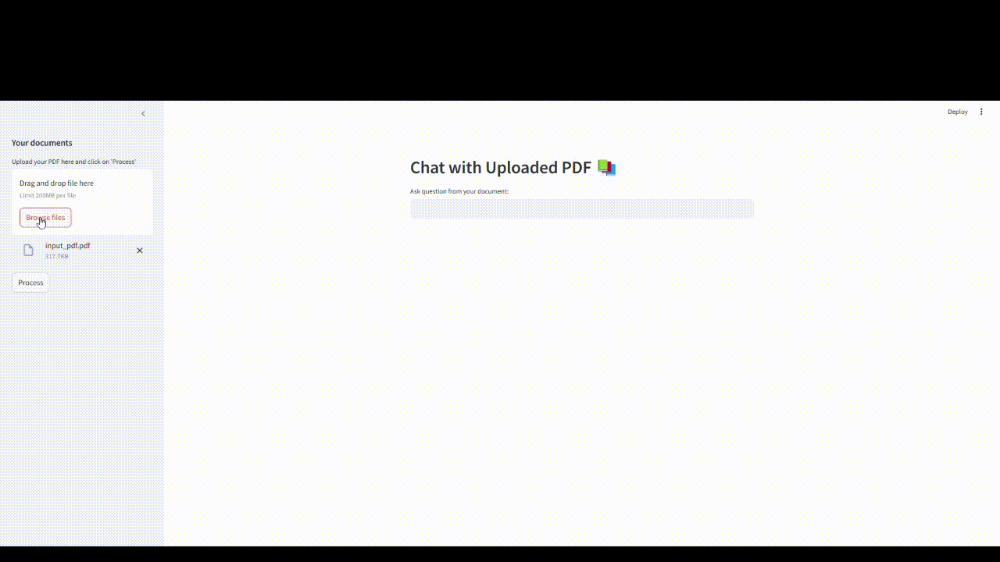

# My RAG Project

## Installation 

Instructions to setup and install everything before running the code.

```bash
# Clone the github repository and navigate to the project directory.
git clone https://github.com/harikiranchivurala/RAG_PDF.git
cd RAG_PDF

#python version 3.10.11
# create and activate the virtual environment
python -m venv name_of_virtualenv  
# activate the virtual environment
# Install all the dependencies and requirements associated with the project.
# run the below command if you want to use sentence transformer model with cuda support
pip install torch torchvision torchaudio --index-url https://download.pytorch.org/whl/cu118
pip install -r requirements.txt
```
## Project structure

```bash
src
├── config.py
├── faiss_vector_store.py
├── pdf_parser.py
├── qdrant_vector_store.py
├── query_agent.py
├── template.py
├── text_splitter.py
app.py
main.py
readme.md
```
- `config.py`: contains all the app related configs
- `faiss_vector_store.py`: code for using FAISS as a vector store
- `pdf_parser.py`: Read the PDF, parse it
- `qdrant_vector_store.py`: code for using FAISS as a vector store this is the default vector store
- `query_agent.py`: Responsible for generating the responses for user queries
- `template.py`: HTML/CSS templates for user and bot
- `text_splitter.py`: splitting the document into chunks for further processing

- `app.py`: for running the inference through CLI
- `main.py`: Running the app through streamlit


## Inference

### Inference using CLI
```bash
python app.py --questions "question1#question2#question3#" --file path_to_pdf/file_name.pdf
```
questions should be separated by #

### Inference using streamlit

```bash


streamlit run main.py
```
By default it'll run on the localhost 8501 port

You can upload the pdf file, click on process, once data is Ingested, you can ask questions and you'll get responses using PDF data as a context based on the query




### TODO
I have used opensoure sentence transformers model for creating embeddings for uploaded file, you can use openai embeddings as well.
Should configure the embedings model from config

